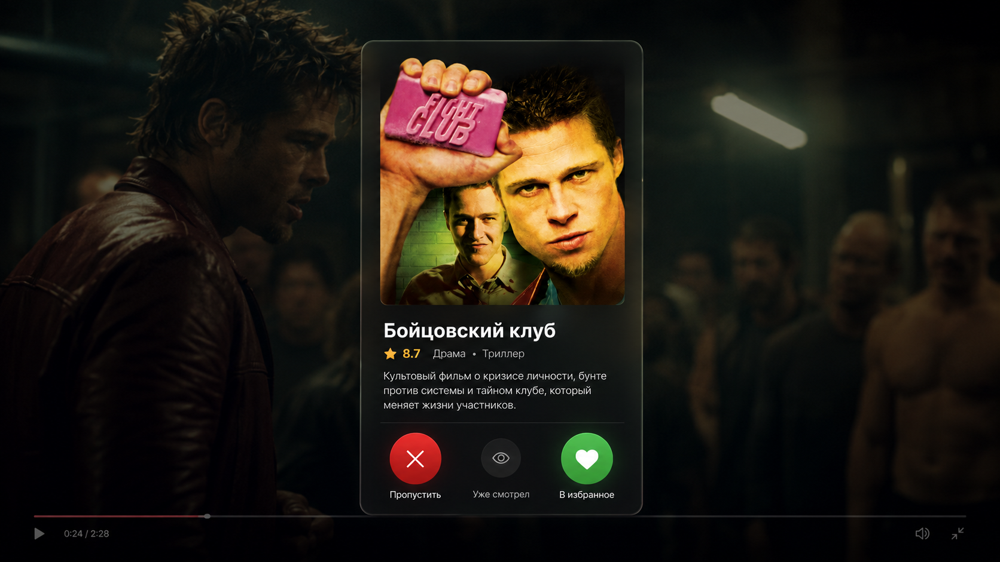

# СвайпКино

Некоммерческий open-source сервис для поиска фильма на вечер.

## Идея

Реализовать удобно подбор фильма для просмотра в формате свайпов Tinder



Взависимости от ваших оценок на КП и свайпов на сайте рекомендации будут адаптироваться к вашим потребностям.

## Пользовательские сценарии

### Без авторизации

- Пользователь открывает каталог.
- Ищет фильмы по названию или применяет фильтры.
- Открывает карточку фильма.
- Смотрит описание, актёров, рейтинг и трейлер.

### После авторизации

- Пользователь входит на платформе.
- Вставляет ссылку на публичный профиль Кинопоиска.
- Сервис импортирует его оценки.
- Парсинг оценок работает через селениум
- При необходимости капча передается пользователю и он проходит ее
- На их основе формируется лента рекомендаций.
- Свайп влево — пропустить.
- Свайп вправо — добавить в избранное.
- Отдельное действие — отметить фильм просмотренным.

### Просмотр
- Пользователь открывает фильм из избранного.
- Нажимает «Смотреть».
- Переходит в WParty или другой подключённый сервис.
- После просмотра отмечает фильм просмотренным.
- Переходит на Кинопоиск и ставит оценку.
- Сервис запрашивает оценить фильм да бы не синхранизовывать КП вновь. 

## Стилистика

Тёмная кинематографичная стилистика с крупными постерами, затемнёнными кадрами из фильмов на фоне и полупрозрачными графитовыми панелями. Интерфейс минималистичный, с мягкими тенями, тонкими рамками, скруглениями и плавными анимациями. Основной текст белый, вторичный — серый, рейтинг выделяется жёлтым, ключевые действия — зелёным и красным. Акцент делается на изображениях и атмосфере фильма, без ярких градиентов, перегруженных блоков и лишних декоративных элементов.

## Стек

### Архитектура

* Монолит
* REST API
* API Gateway
* Docker Compose

### Frontend

* React
* TypeScript
* Tailwind CSS
* Framer Motion

### Backend

* ASP.NET Core Web API
* Entity Framework Core

### Хранилища

* PostgreSQL
* Redis
* MinIO

### Импорт Кинопоиска

* Selenium WebDriver
* Chromium
* Selenium WebDriver Manager

### Тестирование

* xUnit

### Инфраструктура

* Docker
* Docker Compose
* nginx

## Данные и база

PostgreSQL работает на именованном Docker volume `swapkino_postgres-data`. Пересоздание контейнера PostgreSQL не удаляет каталог, а миграции применяются API автоматически при запуске.

Не используйте `docker compose down -v`, если нужно сохранить базу: флаг `-v` удаляет volume. Для безопасной резервной копии запустите:

```bash
./scripts/backup-db.sh
```

Каталог пополняется из TMDB фоновым синхронизатором: сначала загружаются популярные фильмы, затем top-rated. Повторный запуск обновляет существующие записи по TMDB ID и не очищает локальные данные.
